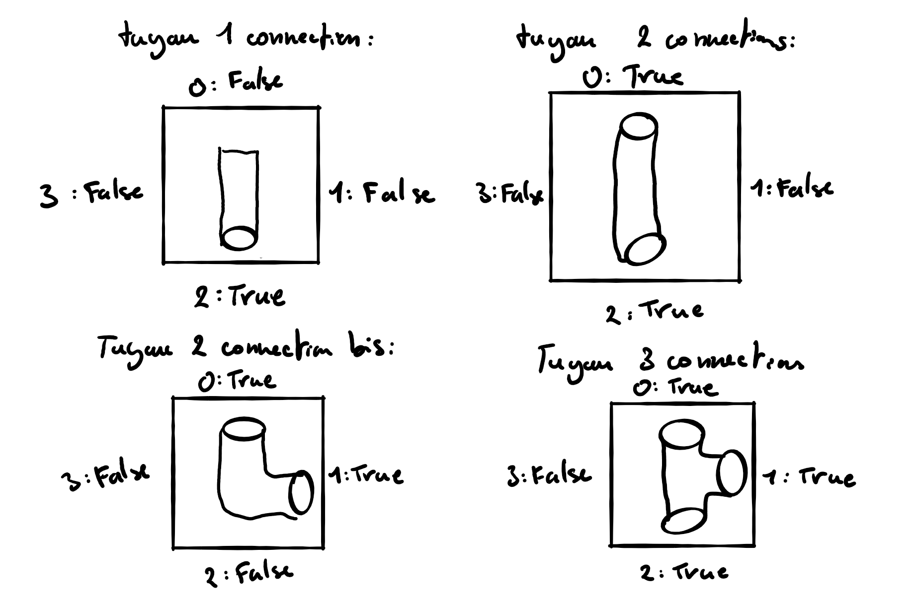

# Projet de programmation : AQUAVIAS

## Modélisation du jeu

Il y a 3 classes principale pour le modèle. 
La classe Tuyau qui servira de bloc de construction pour les niveaux.
La classe Niveau qui représente un niveau du jeu.
La classe Generation qui génére des niveaux aléatoirement.

### Classe Tuyau

Cette classe sera modélisée par un tableau de boolean de taille 4. Chaque indice du tableau correspond à une coordonnée (voir schéma) De plus chaque tuyau possède un boolean rempli qui indique s'il contient de l'eau ou pas.

Il a a en tout 6 tuyaux :

- Un tuyau avec une seule connection qui sert de départ d'eau et un autre tuyau qui sert de recepteur d'eau.
  
  Représentation dans l'interface terminale : ╨ ╞ ╥ ╡

  Représentation dans l'interface graphique :
  
  

- Un tuyau avec 2 connections "suivie".
  
  Représentation dans l'interface terminale : ╚ ╔ ╗ ╝

  Représentation dans l'interface graphique :
  

- Un tuyau avec 2 connections opposées.
  
  Représentation dans l'interface terminale : ║ ═

  Représentation dans l'interface graphique :
  

- Un tuyau avec 3 connections.
  
  Représentation dans l'interface terminale : ╠ ╦ ╣ ╩

  Représentation dans l'interface graphique :
  
  
- Un tuyau avec 4 connections.
  
  Représentation dans l'interface terminale : '╬'

  Représentation dans l'interface graphique :
  

Voici par exemple comment un tuyau à 2 connections opposées serait modéliser.
`[TRUE, FALSE, TRUE, FALSE]`
Cela nous facilitera la rotation (une rotation de 90° vers la droite est un right-shift d'un cran), et la modélisation de l'écoulement de l'eau (deux tuyaux adjacents sont connectés si leur indices opposés sont tout les deux `TRUE`).

Schéma des différents tuyaux :


Il s'agit des tuyaux les plus simples que nous allons implementer au départ. Si le projets avance correctement on rajoutera d'autres type de tuyaux.

### Classe Niveau

Cette classe sera modéliser par une matrice de tuyaux.

Exemple d'affichage d'un niveau dans l'interface terminale :

```bash
╔╝║═╚╔╝═╝
║═╗╝║═╔╚╝
╞═╔╔═╝╗╝╡
╝╚╗║╗║╗╔║
║╝╚╝═║╗═║
╝╚═╔╚╝║╔╗
```

## Stockage des niveaux de jeu

Pour pouvoir stocker les niveaux du jeu on s'est décidé qu'il serait mieux d'utiliser un outil familier.
Au départ on avait hésiter à utiiser des fichiers XML pour stocker les données des niveaux mais le format JSON est plus adapté à nos besoin. Ce sera donc le format que l'on utilisera pour stocker les niveaux.

Le fichier JSON sera structuré de la manière suivante :

```JSON
{
//Niveaux préconçus
"niveaux_off" :
    [
        {
            //La taille du niveau
            "largeur" : 3,
            "longueur" : 4,
            //Placement des tuyaux dans la grille
            "configuration" : "00F23T31T21T20T40T43T10F21T30T22T22T",
            //Resources pour jouer aux jeux(temps ou nombre de coups)
            "resources" : 500,
            //Mode de jeu, temps, nombre de coups, resources infinies
            "type" : 1
        },
        {
            ...
        }
    ]
}
```

La manière dont on va sauvegarder la configuration d'un niveau reste encore à voir en fonction de commment on modélise les tuyaux comme la méthode proposée ci-dessus n'est pas définitive.

On aura au moins 2 fichiers JSON. Un qui servira de "backup" lorsqu'on souhaite réinitialiser un niveau. Et un autre qui servira de sauvegarde pour le joueur.
Cela permettra de pouvoir refaire un niveau afin d'avoir un meilleur score.

## Organisation de l'interface graphique

WIP