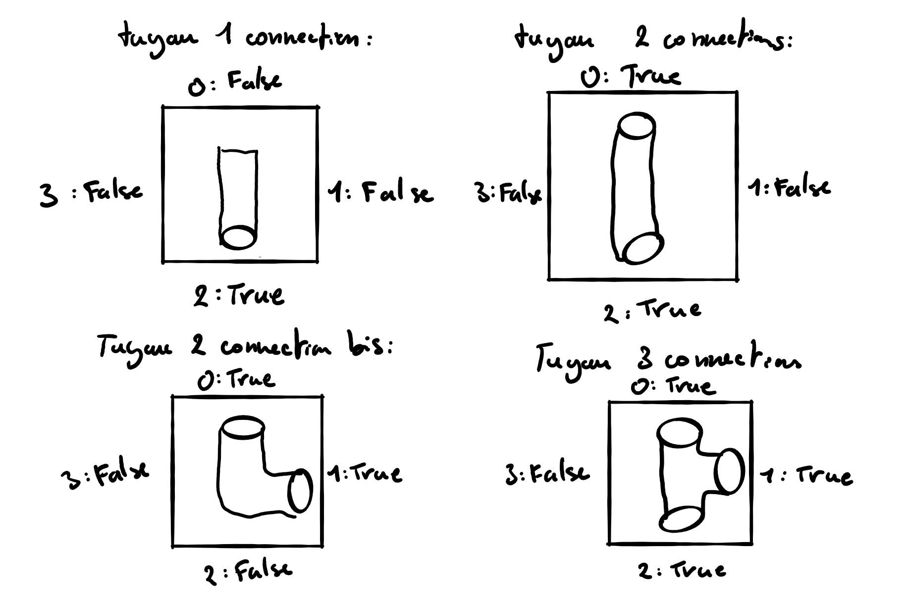

# Projet de programmation : AQUAVIAS

## Liste des membres du projet

- Didelot Yannis 21801118 @ydidel28

- Danyshchuk Ruslan 21803907 @ruslan

- KHIEU William 21806172 @Hyraeth

- Li Julien 21806501 @Juju

## Modélisation du jeu

Pour l'instant nous n'avons que 2 classes principale pour le modèle. La classe Tuyau qui servira de bloc de construction pour les niveaux.
Et la classe Niveau qui représente un niveau du jeu.

### Classe Tuyau

Cette classe sera modélisée par un tableau de boolean de taille 4. Chaque indice du tableau correspond à une coordonnée (voir schéma) De plus chaque tuyau possède un boolean rempli qui indique s'il contient de l'eau ou pas.

Il a a en tout au moins 4 tuyaux :

- Un tuyau avec une seule connection qui sert à la fois d'arrivée d'eau et de recepteur d'eau.
  
  Représentation dans l'interface terminale : ╨ ╞ ╥ ╡

  Représentation dans l'interface graphique : WIP

- Un tuyau avec 2 connections opposées.
  
  Représentation dans l'interface terminale : ║ ═

  Représentation dans l'interface graphique : WIP

- Un tuyau avec 2 connections "suivie".
  
  Représentation dans l'interface terminale : ╚ ╔ ╗ ╝

  Représentation dans l'interface graphique : WIP

- Un tuyau avec 3 connections.
  
  Représentation dans l'interface terminale : ╠ ╦ ╣ ╩

  Représentation dans l'interface graphique : WIP
  
- Un tuyau avec 4 connections.
  
  Représentation dans l'interface terminale : '╬'

  Représentation dans l'interface graphique : WIP

Voici par exemple comment un tuyau à 2 connections opposées serait modéliser.
`[TRUE, FALSE, TRUE, FALSE]`
Cela nous facilitera la rotation (une rotation de 90° vers la droite est un right-shift d'un cran), et la modélisation de l'écoulement de l'eau (deux tuyaux sont connectés si leur indices opposés sont tout les deux `TRUE`).

Schéma des différents tuyaux :


Il s'agit des tuyaux les plus simples que nous allons implementer au départ. Si le projets avance correctement on rajoutera d'autres type de tuyaux.

### Classe Niveau

Cette classe sera modéliser par une matrice de tuyaux.

Exemple d'affichage d'un niveau dans l'interface terminale :

```bash
╔╝║═╚╔╝═╝
║═╗╝║═╔╚╝
╞═╔╔═╝╗╝╡
╝╚╗║╗║╗╔║
║╝╚╝═║╗═║
╝╚═╔╚╝║╔╗
```

## Stockage des niveaux de jeu

Pour pouvoir stocker les niveaux du jeu on s'est décidé qu'il serait mieux d'utiliser un outil familier.
Au départ on avait hésiter à utiiser des fichiers XML pour stocker les données des niveaux mais le format JSON est plus adapté à nos besoin. Ce sera donc le format que l'on utilisera pour stocker les niveaux.

Le fichier JSON sera structuré de la manière suivante :

```JSON
{
//Niveaux préconçus
"niveaux_off" :
    [
        {
            //La taille du niveau
            "largeur" : 3,
            "longueur" : 4,
            //Placement des tuyaux dans la grille
            "configuration" : "00F23T31T21T20T40T43T10F21T30T22T22T",
            //Resources pour jouer aux jeux(temps ou nombre de coups)
            "resources" : 500,
            //Mode de jeu, temps, nombre de coups, resources infinies
            "type" : 1
        },
        {
            ...
        }
    ]
}
```

La manière dont on va sauvegarder la configuration d'un niveau reste encore à voir en fonction de commment on modélise les tuyaux comme la méthode proposée ci-dessus n'est pas définitive.

On aura au moins 2 fichiers JSON. Un qui servira de "backup" lorsqu'on souhaite réinitialiser un niveau. Et un autre qui servira de sauvegarde pour le joueur.
Cela permettra de pouvoir refaire un niveau afin d'avoir un meilleur score.

## Organisation de l'interface graphique

WIP

## Règles du Jeu

## Architecture du programme

Notre programme est divisé en 3 partie : la partie logique du programme (le model), la partie graphique(la vue) et un controller qui gère la communication entre la vue et le model.

### Le model

La partie logique du code qui s'occupe de toute les manipulations du plateau (rotation des tuyaux, chargement de niveau, faire couler l'eau, tester si le niveau est finis, ...) se trouve dans la classe Niveau. Chaque niveau est en faite une matrice de Pipe.
La classe Pipe sert de block de construction pour notre programme. Chaque Pipe est un tableau de boolean de taille 4 qui indique les côtés du tuyaux qui peuvent être connectés et possèdes d'autres attributs qui servent d'informations sur le tuyaux (comme par exemple s'il peut être tourner, s'il est rempli, etc).
La classe Generation sert à générer des niveaux aléatoirement.

Lanceur c'est la classe qu'on appelle pour lancer le jeu
Jeu c'est ce qui concerne le menu principal
MenuNiveau c'est ce qui concerne les sous niveaux et aussi Ruslan y a ajouté la fonction jouer qui permet de lancer une partie

### La vue

La classe fenêtre est le menu de notre interface graphique. C'est ce qui nous affiche la liste des niveaux qui sont disponibles et qui  nous permet de générer des niveaux aléatoirement. Lorsqu'on clique sur un bouton, on appelle une fonction du controller qui lui va s'occcuper d'initialisé un niveau et d'ouvrir une interface graphique adaptée (VueIG).
VueIG sert à afficher une fenêtre avec un plateau de jeu et ouvre une fenêtre lorsque le joueur gagne ou perd. Le plateau du affiché est un tableau de JPanelPipe. Cette classe sert à afficher les images qui correspondent aux tuyaux du niveau.
VueTerm est l'affichage du jeu dans le terminal. C'est une classe qui sert de debuggage.

### Le controller

Le controller s'occupe de lancer un niveau et avertit la vue lorsqu'il y a des changement à faire. Il sert aussi à dire au model lorsqu'il y a quelque chose à faire. Par exemple si le joueur clique sur un tuyau, le controller dit au model de tourner ce tuyau et une fois qu'il est tourner, dire à la vue de se mettre à jour afin d'afficher le tuyau bien tourner.

## Arbre des fichiers

```BASH
Projet
 ┣ src
 ┃ ┣ main
 ┃ ┃ ┗ java
 ┃ ┃ ┃ ┗ Aquavias
 ┃ ┃ ┃ ┃ ┣ controller
 ┃ ┃ ┃ ┃ ┃ ┗ ControllerIG.java
 ┃ ┃ ┃ ┃ ┣ model
 ┃ ┃ ┃ ┃ ┃ ┣ Color.java
 ┃ ┃ ┃ ┃ ┃ ┣ Generation.java
 ┃ ┃ ┃ ┃ ┃ ┣ Jeu.java
 ┃ ┃ ┃ ┃ ┃ ┣ Lanceur.java
 ┃ ┃ ┃ ┃ ┃ ┣ MenuNiveau.java
 ┃ ┃ ┃ ┃ ┃ ┣ Niveau.java
 ┃ ┃ ┃ ┃ ┃ ┣ Pipe.java
 ┃ ┃ ┃ ┃ ┃ ┣ PipeFactory.java
 ┃ ┃ ┃ ┃ ┃ ┣ Readme.md
 ┃ ┃ ┃ ┃ ┃ ┗ Score.java
 ┃ ┃ ┃ ┃ ┗ vue
 ┃ ┃ ┃ ┃ ┃ ┣ GUI
 ┃ ┃ ┃ ┃ ┃ ┃ ┣ Fenetre.java
 ┃ ┃ ┃ ┃ ┃ ┃ ┣ JPanelPipe.java
 ┃ ┃ ┃ ┃ ┃ ┃ ┣ ScoreIG.java
 ┃ ┃ ┃ ┃ ┃ ┃ ┣ VueIG.java
 ┃ ┃ ┃ ┃ ┃ ┃ ┗ VueTerm.java
 ┃ ┃ ┃ ┃ ┃ ┗ App.java
```

### Jeu

La règle principale est de réussir à relier la source à la ville en formant une série finie de "tuyau" ou de "pont".

Par contre, il ne faut pas qu'un tuyau reliant ces deux points menne à une issue vide.

Il y a 3 variantes dans le jeu:

- La première variante est que la source et les mouvements sont illimités. Il n'y a donc aucune contrainte pour ces niveaux

- La deuxième variante est que la source est illimitée mais les mouvements sont limités.

- La troisième variante est le contraire, c'est-à-dire que la source est limitée mais les mouvements illimités. 
  (Pour cette variante on peut implémenter un compte à rebour qui se lance si on rencontre un tuyau qui a une sortie[True] et qui ne rencontre pas de tuyau ou qui rencontre un tuyau qui a une entrée[False])

### Menu

Un niveau est accessible si et seulement si le niveau précédent a déjà été terminé. Une ecception existe pour le tout premier niveau.

Un niveau déjà fait se démarque des autres par un affichage d'une couleur différente.
